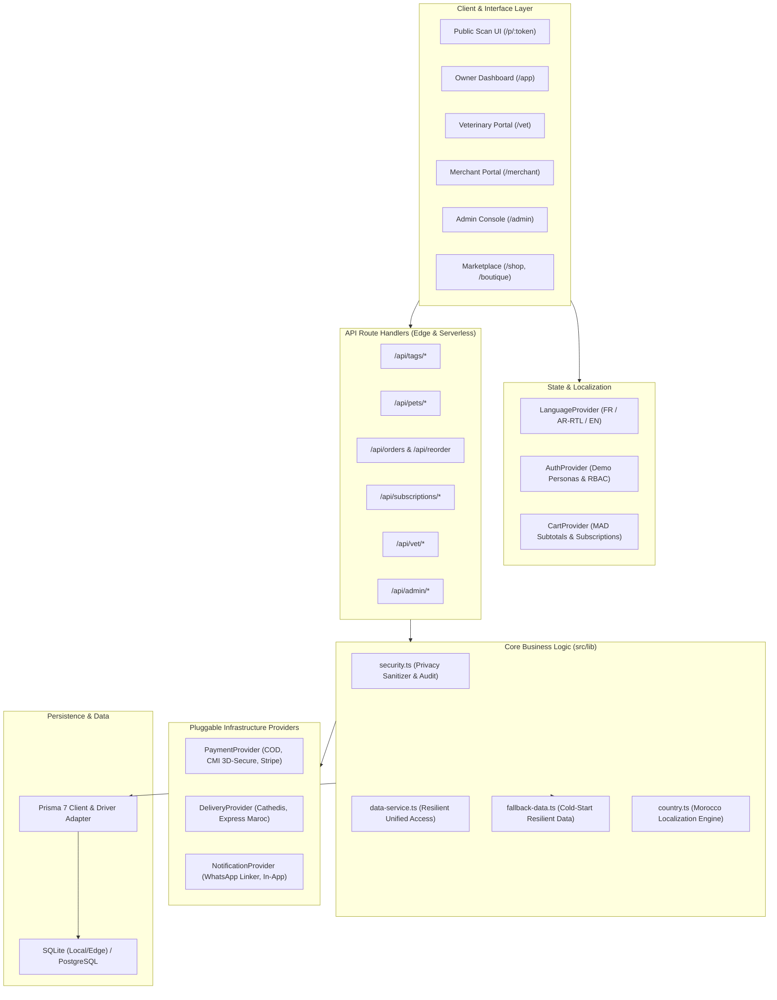

# ZAYA — System Architecture & Technical Specification

## 1. Architectural Overview

ZAYA is architected as a modular, unified pet-care technology platform built on Next.js 16 (App Router), React 19, TypeScript, and Prisma 7. The platform converges physical hardware (laser-engraved NFC + QR code tags), proactive veterinary healthcare tracking, smart automated reminders, and localized Moroccan e-commerce into a continuous care flywheel.

---

## 2. The Core ZAYA Flywheel

Rather than treating the NFC tag as a standalone gadget, ZAYA uses the tag as an onboarding gateway into recurring engagement and commercial retention:

1. **Tag Acquisition & Activation**: The pet owner receives an NFC + QR tag (`prod_zaya_tag`, 79 MAD) with an opaque cryptographic token (e.g., `luna_sec_7891`).
2. **Digital Pet Identity Creation**: The tag pairs to a pet record in `/app/pets/[id]`, capturing species, breed, microchip number, emergency contacts, and vet clinic affiliation.
3. **Preventive Health Records**: The owner and veterinary practitioner log vaccinations, deworming, and weights.
4. **Smart Reminders**: System schedules preventive deadlines (e.g., annual Purevax vaccine rappel, monthly flea pipette).
5. **Direct E-Commerce Conversion**: Reminders trigger pre-filled reorder cards for prescribed diets (e.g., Royal Canin British Shorthair 4kg) and parasite preventatives (Bravecto).
6. **Moroccan Fulfillment**: Orders are dispatched via Moroccan couriers (Cathedis) with Cash on Delivery (COD) or Moroccan CMI bank cards.
7. **Recurring Subscription Discount (-5%)**: Owners convert frequent consumables to automated 21-day, 30-day, or 90-day subscriptions.

---

## 3. High-Resilience Serverless Architecture

In modern serverless environments (such as Vercel Serverless Functions), ephemeral file-based SQLite databases or cold instances can experience empty state before background replication triggers.

To guarantee zero downtime and eliminate HTTP 404s for visitors:
- **Resilient Fallback Pattern**: Implemented in [`src/lib/data-service.ts`](file:///C:/zaya/src/lib/data-service.ts) and [`src/lib/fallback-data.ts`](file:///C:/zaya/src/lib/fallback-data.ts).
- If database queries throw or return empty sets (0 rows), the service seamlessly serves the curated Moroccan dataset (Products in MAD, Categories, Demo Pets Luna/Max/Milo, Vet Clinics).
- Operations that mutate state (like toggling Lost Mode or placing an order) write to the database when available and immediately reflect updates in-memory to preserve user experience without failure.

---

## 4. Role-Based Access Control (RBAC) & Personas

ZAYA defines four distinct roles:

| Role | Permissions & Responsibilities | Key Routes |
|---|---|---|
| `OWNER` | Manage own pets, activate tags, toggle Lost Mode, order supplies, manage subscriptions, view reminders. | `/app`, `/app/pets/[id]`, `/app/reminders`, `/app/orders`, `/app/subscriptions` |
| `VET` | Consult assigned patients, log official vaccinations and deworming, write clinical notes, register emergency contacts. | `/vet` |
| `MERCHANT` | Monitor inventory, manage pricing in MAD, inspect sales revenue (GMV), review stock alerts. | `/merchant` |
| `ADMIN` | Global KPIs (registered pets, active tags, lost pets, GMV), inspect audit trail, switch demo personas. | `/admin` |

---

## 5. Security & Privacy Sanitation Architecture

To protect pet owner privacy and comply with Moroccan Law 09-08 (CNDP) regarding personal data protection:

### Public vs Private Data Segregation
The public scan endpoint (`/p/[token]` and `/api/tags/scan/[token]`) exposes **only** safe identifying information:
- **Exposed**: Pet name, species, breed, photo, approximate age (computed dynamically), sex, color, lost status, emergency notes, WhatsApp contact button, emergency phone number, and clinic name.
- **Strictly Stripped**: Owner exact residential address, email address, password hash, internal database IDs (`User.id`, `Pet.id`, `Tag.id`), private medical records, batch numbers, and uploaded PDF documents.

### Unforgeable Opaque Tokens
- Physical tags store **only** an alphanumeric token (e.g. `luna_sec_7891`).
- The sequential internal database ID (`id: "tag_luna"`) is never placed on the physical tag or query parameters.

### Security Audit Logging
Every sensitive action produces an immutable audit record in the `AuditLog` table:
- `TAG_SCANNED`: Recorded each time an NFC tag or QR code is accessed, along with timestamp and scan count increment.
- `LOST_MODE_ENABLED` / `LOST_MODE_DISABLED`: Recorded whenever an owner marks an animal lost or safe.
- `FINDER_ALERT_SUBMITTED`: Recorded when a finder shares their coordinates or phone number.
