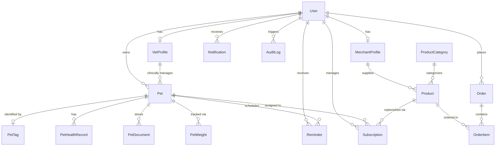

# ZAYA — Data Models & Schema Reference

This document outlines the complete relational data model powering the ZAYA platform. The database is managed via Prisma ORM 7 with native driver adapters for both SQLite (development & edge) and PostgreSQL (cloud production).

---

## 1. Entity-Relationship Diagram (Mermaid)

---

## 2. Models Specification

### 2.1 Identity & User Ecosystem

#### `User`
Central account record for all four platform personas (`OWNER`, `VET`, `MERCHANT`, `ADMIN`).
- `id` *(UUID, PK)*: Internal immutable user identifier.
- `email` *(String, Unique)*: Login and notification recipient.
- `name` *(String)*: Full user display name.
- `role` *(String)*: Access level (`OWNER`, `VET`, `MERCHANT`, `ADMIN`).
- `phone` *(String)*: Moroccan phone number format (`+212 6XX XX XX XX`).
- `city` *(String)*: Delivery city (e.g. Casablanca, Rabat, Marrakech).
- `address` *(String)*: Residential delivery address. **Private tier**.
- `preferredLocale` *(String)*: Language preference (`fr`, `ar`, `en`). Default `fr`.
- `avatarUrl` *(String)*: Profile photo URL.

#### `VetProfile`
Extended credentials and clinic metadata for veterinary practitioners.
- `userId` *(UUID, FK)*: Linked `User` record.
- `clinicName` *(String)*: Registered veterinary establishment name.
- `licenseNumber` *(String)*: Official Ordre National des Vétérinaires (ONVM) registration number.
- `phone` / `emergencyPhone` *(String)*: Regular line and 24/7 emergency emergency hotline.
- `openingHours` *(String)*: Operating timetable (e.g. "Lun - Sam : 08:30 - 20:00 (Urgences 24/7)").
- `verified` *(Boolean)*: Platform verification badge status.

#### `MerchantProfile`
E-commerce merchant and supplier credentials.
- `storeName` *(String)*: Trading store name (e.g. "Atlas Pet Boutique Casablanca").
- `verified` *(Boolean)*: Merchant authorization status.

---

### 2.2 Pet Identity & Health Records

#### `Pet`
Core digital identity record for a companion animal.
- `id` *(UUID, PK)*: Immutable pet ID.
- `name` *(String)*: Pet name.
- `species` *(String)*: `DOG` | `CAT` | `OTHER`.
- `breed` *(String)*: Breed information (e.g. "British Shorthair", "Berger Allemand").
- `birthDate` *(DateTime)*: Used to calculate dynamic approximate age on public scan.
- `sex` *(String)*: `MALE` | `FEMALE`.
- `microchipNumber` *(String, Unique)*: ISO 11784/11785 15-digit electronic transponder ID.
- `photoUrl` *(String)*: Pet portrait URL.
- `isLost` *(Boolean)*: Urgent lost state flag. Indexed for rapid querying.
- `lostNotes` *(String)*: Emergency instructions displayed when lost.
- `lostSince` *(DateTime)*: Timestamp when lost mode was initiated.
- `emergencyContact` / `emergencyPhone` *(String)*: Secondary emergency contact name & phone.
- `ownerId` *(FK)*: Linked owner account.
- `vetId` *(FK, Optional)*: Assigned veterinary clinic.

#### `PetTag`
Laser-engraved physical NFC tag and QR code representation.
- `code` *(String, Unique)*: Human-readable alphanumeric code stamped on medal (e.g. `ZY-CAS-101`).
- `token` *(String, Unique)*: High-entropy opaque public token (e.g. `luna_sec_7891`).
- `status` *(String)*: `ACTIVE` | `INACTIVE` | `REVOKED`.
- `scanCount` *(Int)*: Telemetry tracking total times scanned.
- `lastScannedAt` *(DateTime)*: Timestamp of most recent tap/scan.

#### `PetHealthRecord`
Clinical vaccination and medical interventions.
- `type` *(String)*: `VACCINATION`, `DEWORMING`, `FLEA_TICK`, `MEDICATION`, `SURGERY`, `CHECKUP`.
- `title` *(String)*: E.g., "Vaccin Purevax RCP + Rage", "Milbemax Vermifuge".
- `dateAdministered` *(DateTime)*: Date procedure took place.
- `nextDueDate` *(DateTime)*: Target date for booster/rappel. Used to auto-create reminders.
- `providerName` *(String)*: Administering clinic or veterinary surgeon name.
- `batchNumber` *(String)*: Pharmaceutical lot/batch serial number.

#### `PetWeight`
Growth and weight monitoring log.
- `weightKg` *(Float)*: Body mass in kilograms (e.g. 4.25 kg).
- `recordedAt` *(DateTime)*: Measurement date.

---

### 2.3 E-Commerce Marketplace & Subscriptions

#### `Product` & `ProductCategory`
Moroccan pet marketplace catalog.
- `priceMAD` *(Float)*: Selling price in Moroccan Dirhams.
- `compareAtPriceMAD` *(Float, Optional)*: Strike-through reference price.
- `targetSpecies` *(String)*: Filterable target (`ALL`, `DOG`, `CAT`).
- `isRecurringEligible` *(Boolean)*: Determines if 5% repeat subscription discount applies.
- `defaultIntervalDays` *(Int)*: Recommended replenishment period (e.g. 21, 30, 90 days).

#### `Order` & `OrderItem`
Customer transaction and courier delivery tracking.
- `orderNumber` *(String, Unique)*: E.g. `ZAYA-ORD-10482`.
- `paymentMethod` *(String)*: `CASH_ON_DELIVERY` | `CMI_CARD` | `STRIPE`.
- `paymentStatus` *(String)*: `PENDING` | `PAID` | `FAILED`.
- `deliveryStatus` *(String)*: `PENDING` | `PREPARING` | `DISPATCHED` | `DELIVERED`.
- `trackingNumber` *(String)*: Moroccan courier tracking code (e.g. `ZAYA-MA-78211`).
- `deliveryFeeMAD` *(Float)*: 25 MAD (or 0 MAD if subtotal $\ge 450$ MAD).

#### `Subscription`
Automated repeat replenishment contract.
- `intervalDays` *(Int)*: Cadence (e.g. 30 days).
- `unitPriceMAD` *(Float)*: Contract price reflecting 5% recurring subscriber benefit.
- `nextDeliveryDate` *(DateTime)*: Scheduled dispatch date.
- `status` *(String)*: `ACTIVE` | `PAUSED` | `CANCELLED`.

---

## 3. Data Privacy & Classification Tiers

| Classification Tier | Fields & Entities | Exposure Scope |
|---|---|---|
| **Tier 1: Public (Finder Safe)** | Pet name, species, breed, photo, approximate age, color, lost status, emergency contact, clinic name, WhatsApp action link. | Publicly queryable via `/p/[token]`. No authentication required. |
| **Tier 2: Authenticated Owner** | Full birth date, microchip number, medical record dates, reminders, order history, subscriptions. | Restricted to owning user via authenticated session or demo persona switch. |
| **Tier 3: Clinical (Vet Portal)** | Vaccine batch numbers, clinical notes, diagnostic observations, weight history. | Restricted to the treating veterinary clinic (`VET` role). |
| **Tier 4: Confidential (Private)** | Owner residential address, email, password hash, internal database IDs. | **Strictly confidential.** Never exposed to finders or public endpoints. |
